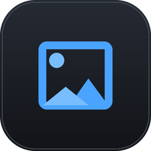
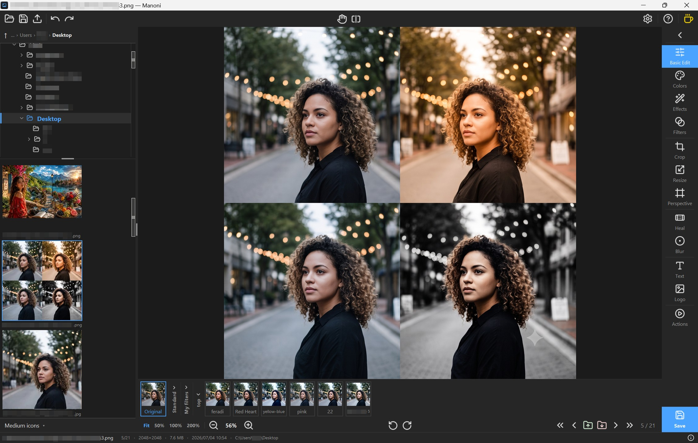

<div align="center">



# Manoni

**A fast, simple photo browser, culler & editor — built for a weak laptop.**

Browse a folder → keep the good ones → cull the rest → quick edits → export.

&nbsp;&nbsp;
&nbsp;&nbsp;
&nbsp;&nbsp;
&nbsp;&nbsp;
&nbsp;&nbsp;
&nbsp;&nbsp;
&nbsp;&nbsp;


Pure **Python + Tkinter + Pillow**. Tiny, open source, fully ours to extend.

**[Website](https://kandelucky.github.io/Manoni)** · **[Download](https://github.com/kandelucky/Manoni/releases/latest)** · **[Community & sharing](https://github.com/kandelucky/Manoni/discussions)**

<br>



</div>

---

## Who it's for

For photographers who shoot a lot and work on a modest machine. Manoni is built
to **cull a big batch fast, make quick but real edits, and hand back clean
copies** — light enough to stay smooth on a weak laptop, simple enough to stay
out of your way.

You'll feel at home if you:

- shoot in **volume** and need to sort keepers from rejects quickly;
- want **real edits** — tone, colour, crop, heal, filters — without a heavy install;
- work on a **weak or old laptop** and want it to stay fast;
- care that your **originals are never altered** (culling only *moves* files, edits export copies).

---

## Run

**Most people — install it.** Download the **Windows installer**
(`Manoni-Setup.exe`) from the
[Releases page](https://github.com/kandelucky/Manoni/releases/latest), run it,
and launch Manoni from the Start menu. No Python needed — and it registers
`.mnf` / `.mnl` files so a double-click opens them in Manoni.

**Run from source** (for development):

```bash
# one-time setup
python -m venv .venv
.venv\Scripts\python -m pip install -r requirements.txt

# run (optionally pass a folder)
.venv\Scripts\python manoni.py
.venv\Scripts\python manoni.py "C:\path\to\photos"
```

- Requires Python 3.14.
- The only dependency is **Pillow**. `tkinter` ships with Python.

---

## Browse & cull

 A virtualized thumbnail
strip (handles thousands of files) beside a nested folder-tree sidebar. Click or
press <kbd>←</kbd> / <kbd>→</kbd> to browse, <kbd>↑</kbd> / <kbd>↓</kbd> to cull
each photo into configurable **keep** / **reject** folders. Info bar (name, size,
date), before/after compare, and your session is restored on the next launch.
Nothing is deleted — culling only *moves* files, and <kbd>Ctrl</kbd>+<kbd>Z</kbd>
undoes any move.

---

## The editor

A tool rail on the right — click a tool to open its panel.

| | Tool | What it does |
|:--:|---|---|
|  | **Basic** | White balance · tone (highlights / shadows / whites / blacks) · detail (clarity / texture / denoise / dehaze / sharpen) · colour (vibrance / saturation) |
|  | **Color mixer** | Per-hue HSL bands, plus dedicated gold & skin mini-HSLs |
|  | **Effects** | Vignette · grain · split-tone |
|  | **Crop** | Trim, straighten a tilted horizon (±45°), rotate 90°, flip H / V — with ratio and social presets |
|  | **Resize** | Resize one photo, or every photo in a folder and its subfolders in one batch |
|  | **Perspective** | Fix keystoning, straighten converging lines |
|  | **Heal & Clone** | Remove blemishes (auto, or <kbd>Alt</kbd>+click a clone source) |
|  | **Focus blur** | Blur the surroundings, keep the subject sharp |
|  | **Text & Watermark** | Live text overlays — many per photo, snap to a corner |
|  | **Logo** | Drop a transparent PNG onto the photo — many per photo, with size / opacity / tint / flip and corner-snap |
|  | **Filters** | Saved slider presets with a clickable preview strip |
|  | **Actions** | Record a macro and replay it on one photo or a whole folder |

Undo / redo · a live histogram · before / after compare (a split line, or a
press-and-hold peek) · dark / light theme with an accent colour · an English,
Georgian & Polish UI.

---

## Filters & the "Last" slot

 A **filter** is a saved
slider preset — one click applies the whole look. The strip under the photo
previews every filter *on the current photo*.

 The moment you save a
photo, its edit is pinned as a **"Last"** slot in the strip and the filter list —
click it to apply the same look to the next photo, no saving needed. "Last" is
session-only; its `…` menu can promote it into a permanent named filter.

 **Share filters.** A
filter group's `…` menu exports the whole group to a small `.mnf` file — send it
to a friend, and they load it from the **Import** button pinned atop the Filters
panel (or just double-click the file). Swap looks with other people on the
[Community board](https://github.com/kandelucky/Manoni/discussions/categories/filters).

---

## Export

 **Save as…** writes a
full-resolution copy as JPEG / PNG / WEBP — to an `_edited/` subfolder or one
fixed folder. Metadata (camera info, date, GPS, colour profile) is kept or
stripped per your choice, and colours can be **converted to sRGB** so a
wide-gamut photo still looks right on the web. The original is **never touched**.

 An **info** button in
the top bar shows a photo's full metadata — camera, capture, colour profile and
location — and can **wipe GPS & EXIF** from a file before you share it.

---

## Keyboard

| Keys | Action |
|---|---|
| <kbd>←</kbd> / <kbd>→</kbd> | Previous / next photo |
| <kbd>↑</kbd> / <kbd>↓</kbd> | Keep / reject the current photo |
| <kbd>Ctrl</kbd>+<kbd>O</kbd> | Open a folder of photos |
| <kbd>Ctrl</kbd>+<kbd>S</kbd> | Quick-save an edited copy *(Save-as the first time)* |
| <kbd>Ctrl</kbd>+<kbd>Z</kbd> | Undo |
| <kbd>Ctrl</kbd>+<kbd>Y</kbd> | Redo *(or <kbd>Ctrl</kbd>+<kbd>Shift</kbd>+<kbd>Z</kbd>)* |
| <kbd>Ctrl</kbd>+<kbd>R</kbd> | Show / hide the pixel rulers |
| <kbd>[</kbd> / <kbd>]</kbd> | Shrink / grow the heal brush |
| <kbd>R</kbd> | Start / stop recording an action |
| <kbd>Esc</kbd> | Cancel recording |
| <kbd>P</kbd> | Replay the highlighted action on the current photo |
| <kbd>Shift</kbd>+<kbd>P</kbd> | Replay it over the whole folder |

The  **Help** button in
the top bar opens a tabbed guide covering all of the above.

---

## Any language

The interface ships in **English, Georgian and Polish**, and adding your own is easy —
no code, no rebuild. **Settings → General → Add your language** generates a
template listing every phrase in the app; translate the ones you want, then
import it back. Anything you leave untranslated simply stays English, so even a
half-finished pack works the moment you load it. Share your pack — or grab
someone else's — on the
[Community board](https://github.com/kandelucky/Manoni/discussions/categories/language-packs).

---

## TODO

- [x] **`.mnf` / `.mnl` file types** — filters export as `.mnf`, languages as
  `.mnl`; opening or dropping one on the window imports it.
- [x] **Register the file types with Windows** — double-click a `.mnf` / `.mnl`
  opens Manoni, with their own file icons *(in the installer)*.
- [x] **Windows installer** — single-instance, "Open with Manoni", drag & drop, a
  PyInstaller build and an Inno Setup installer *(ships as Setup.exe)*.
- [x] **Community sharing** — a
  [Discussions board](https://github.com/kandelucky/Manoni/discussions) for
  swapping language packs and filter groups, with a how-to pinned in each category.
- [ ] **In-app sharing** — share / receive buttons inside Manoni, so you can
  publish or grab a pack without leaving the app.
- [ ] **RAW support** — an optional add-on (installer tick-box or on-demand
  download) so the base app stays light; export as JPEG or 16-bit TIFF.

## License

Manoni is free software, released under the
[GNU General Public License v3.0](LICENSE). You can use, study, share and
modify it; anything built on it must stay under the same license.
